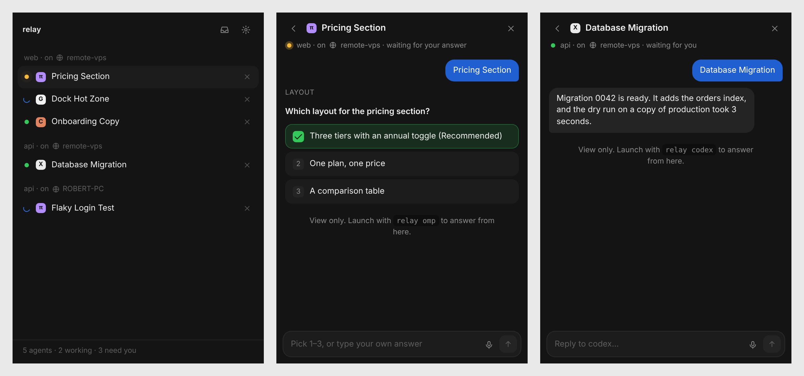

<div align="center">

# Relay

**Never keep an agent waiting.**

A tiny dock on the edge of your screen that watches every coding agent you run (omp, Grok, Claude Code, Codex, OpenCode, Gemini, Cursor, Aider, Droid, anything in a terminal), on this PC or a VPS.
It lights up when one needs you. Answer in a keystroke, by voice, or from your phone.



</div>

## Why

You run five agents in five terminals. One has been asking a question for twenty minutes. Relay puts every agent's status in one place, pulls their questions into an inbox, and types your answer back into the right terminal, without you switching windows.

It drives the official CLIs, so it works with **whatever subscriptions you already have** (Claude Max, ChatGPT Pro, SuperGrok, omp with any provider). No API keys, nothing sent anywhere but your own machine.

## Features

- **Edge dock**: floating pills on the side of your screen. One status dot per agent: blue spinner = working, amber = has a question, green = waiting for you.
- **Inbox**: every question from every agent in one list. *"Nothing needs you. Suspiciously quiet."*
- **Answer in a keystroke**: `Ctrl+Alt+K` jumps to whatever's waiting, `1`–`9` picks an option, `Enter` sends.
- **Undo**: every answer waits a moment (configurable) before it's typed in. `Esc` takes it back.
- **Press to talk**: double-tap and hold `Alt`, speak, let go. Speech-to-text is [Whisper](https://huggingface.co/onnx-community/whisper-small) running on your own GPU (WebGPU, with a CPU fallback). Nothing is uploaded, no keys, about half a second per sentence.
- **Start agents on any model**: pick a harness, a model from its live list (omp, Grok, OpenCode and Cursor list theirs; any id works for the rest), and a folder. Save combos as one-click presets.
- **Two-minute setup**: a first-run guide finds your agent CLIs, connects them, downloads the voice model, and puts `relay` on your PATH.
- **Screenshots to agents**: one click attaches your screen to the reply.
- **See every agent**: grouped by project and machine, local or `ssh`'d VPS.
- **Take it anywhere**: open Relay on your phone over Wi-Fi or through a private Cloudflare link, and add it to your home screen.
- **Settings**: voice quality (Fast, Balanced or Best), dock side and screen, hotkeys, undo window, notifications, sounds, start with Windows.

## Supported agents

| Agent | How Relay sees it | Questions as cards |
|---|---|---|
| **omp** (oh-my-pi) | extension (`~/.omp/agent/extensions/relay.ts`) | ✅ `ask` tool |
| **Grok Build / Grok Bot** | Claude-compatible hooks | ✅ |
| **Claude Code** | hooks (`~/.claude/settings.json`) | ✅ `AskUserQuestion` |
| **Codex** | `notify` (your existing notify program is kept and chained) | — |
| OpenCode, Gemini CLI, Cursor Agent, Aider, Factory Droid, any CLI | `relay <cmd>` activity detection | — |

Start any agent through Relay so it can type answers for you:

```
relay omp
relay grok
relay claude
relay codex
relay opencode      # or any other command
```

Agents started *without* `relay` still show up (view only) for the hooked CLIs.

## Install (Windows)

Needs Node.js 18+.

```
git clone https://github.com/OnlyTerp/relay
cd relay
setup.bat     # installs everything
start.bat     # launches Relay; the setup guide takes it from there
```

Or grab `Relay Setup.exe` from [Releases](https://github.com/OnlyTerp/relay/releases) and run `npm i -g ./cli && relay install` once.

## Voice models

| Quality | Model | Download | Notes |
|---|---|---|---|
| Fast | `onnx-community/whisper-base` | ~150 MB | fine on any PC |
| Balanced (default) | `onnx-community/whisper-small` | ~500 MB | accurate, fast on a GPU |
| Best | `onnx-community/whisper-large-v3-turbo` | ~1 GB | needs a GPU |

Models download once from Hugging Face and run locally through [transformers.js](https://github.com/huggingface/transformers.js).

## Remote machines

```
ssh -R 7777:127.0.0.1:7777 you@vps
# on the VPS
git clone https://github.com/OnlyTerp/relay && npm i -g ./relay/cli
export RELAY_TOKEN=<token from Relay → Settings → Remote machines>
relay install
relay omp
```

## Shortcuts

| | |
|---|---|
| `Ctrl+Alt+K` | answer what's waiting |
| `Alt` `Alt` (hold) | talk |
| `Ctrl+Alt+Space` | toggle talk |
| `Ctrl+Alt+O` | all agents |
| `1`–`9` | pick an option |
| `Esc` | undo / back |

All of them can be changed in Settings.

## How it works

```
 your terminal ── relay omp ──► pseudo-terminal ──► omp
                     │  ▲                            │
                     │  └── answers typed back in    │ extension / hooks
                     ▼                               ▼
              ┌──────────── Relay hub (127.0.0.1:7777, token) ────────────┐
              │ sessions · questions · undo queue · websocket to every UI │
              └──────────┬───────────────────────┬────────────────────────┘
                     edge dock + panel        phone (Wi-Fi / Cloudflare link)
```

- `cli/` is the `relay` command. It runs the agent in a pseudo-terminal (`node-pty`), mirrors it to your terminal, installs integrations, and forwards hook events.
- `app/` is the Electron app: the hub (`hub.js`), the dock and panel UI (`ui/`), settings, hotkeys, voice, and the phone link.
- Everything is local. The hub listens on `127.0.0.1` behind a random token in `~/.relay/token`.

## License

MIT
